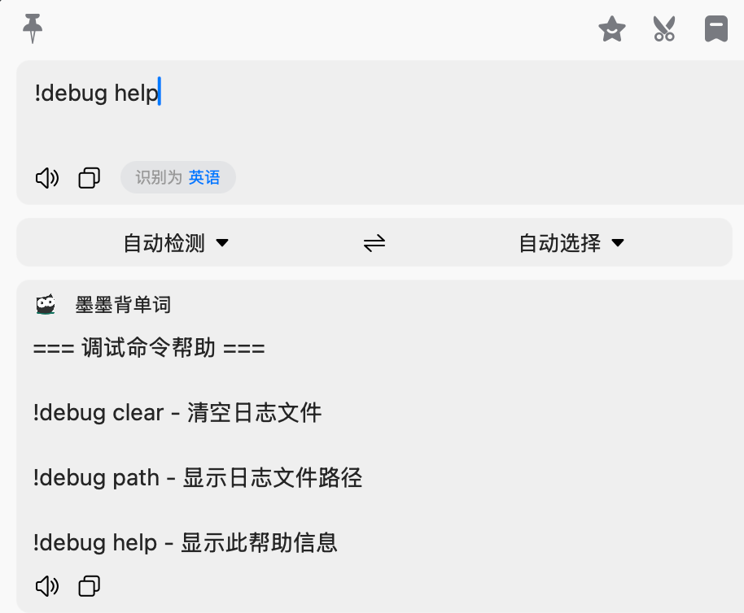

# 墨墨背单词 Bob 插件

[English Documentation](./docs/README-en.md)

## 简介

本插件可以将 Bob 查询的单词或词组添加到墨墨背单词的云词库中，可在墨墨背单词中将云词库中的单词加入每日学习计划，方便复习。

参考了 [chriscurrycc/bob-plugin-maimemo-notebook](https://github.com/chriscurrycc/bob-plugin-maimemo-notebook) 的实现。

相较于`bob-plugin-maimemo-notebook`插件，额外支持异步添加单词，效率更高。且代码更加符合 Bob 插件的规范，方便后续功能新增和维护。

目前仅支持添加单词或词组，不支持添加句子。

## 功能

- 将英文单词或词组添加到墨墨云词本
- 支持指定已有云词本或创建新云词本
- 异步添加单词，无需等待添加完成
- 自动缓存待添加单词, 支持失败重试

## 使用方法

1. 安装 [Bob](https://bobtranslate.com/)

2. 下载此插件并安装（点击插件图标 > 安装插件 > 选择下载的插件文件）

3. 打开墨墨背单词 App，在「我的 > 更多设置 > 实验功能 > 开放 API」申请并复制 Token

4. 把 Token 填入 Bob 偏好设置 > 服务 > 左下角「+」号 > 选择添加此插件后的「墨墨背单词 Token」输入框中

5. 在插件配置界面填写「墨墨云词库名称」，该词库将作为插件添加单词的默认词库。如果不填，则默认使用名为 Bob-Plugin 的词库。如果词库不存在，将会自动创建。

6. 保存配置

## 开发

### 打包

修改项目代码后，执行以下命令将自动基于最新代码生成插件压缩包：

```bash
./build-plugin.sh
```

### 调试

该项目的 log 会输出在 `~/Library/Containers/com.hezongyidev.Bob/Data/Documents/InstalledPluginSandbox/bobplugin.momo-voc/momo-voc.log` 文件中（可能需要根据实际情况调整）。

并且支持在翻译页面输入 `!debug` 调整部分信息:



## License

本项目采用 MIT 许可证 - 查看 [LICENSE](../LICENSE) 文件了解详情。
